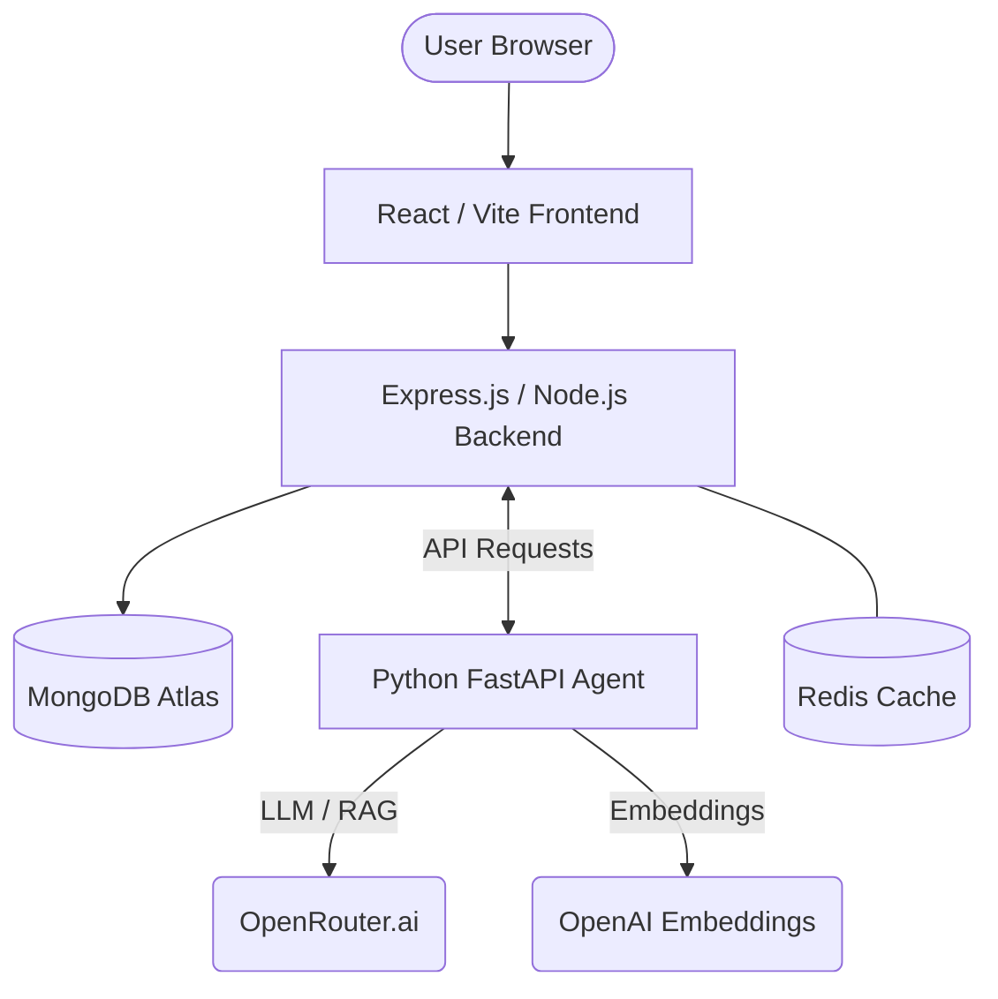

# 🤖 MOR: AI-Driven MERN Blog Platform

<p align="center">
  
  
  
  
  
  
</p>

---

### 🌐 **Project Mission**
**MOR** (Modern Omniscient Reader) is a state-of-the-art blogging platform that bridges the gap between modern web development and Artificial Intelligence. It doesn't just host blogs; it **generates** them, **indexes** them, and allows users to **"Ask AI"** about any post using Retrieval-Augmented Generation (RAG).

---

## 🚀 Key Features

| Feature | Description |
| :--- | :--- |
| **🧠 AI Agent Service** | Automated blog generation based on trending topics or user prompts. |
| **🔍 RAG-Powered Q&A** | Each blog is indexed via vector embeddings, allowing users to ask specific questions. |
| **🖥️ Admin Dashboard** | Manage posts, users, and trigger AI generation with a single click. |
| **🐳 Dockerized** | Seamlessly orchestrated containers for Frontend, Backend, and AI Agent. |
| **💨 Redis Caching** | High-performance content delivery using Redis for blog list caching. |

---

## 🏗️ Technical Architecture

The project is split into three core microservices, communicating over a protected internal network:



---

## 🛠️ Technology Stack

### **Core Services**
| Service | Technology | Purpose |
| :--- | :--- | :--- |
| **Frontend** | React, Vite, Framer Motion, Lucide | Responsive & Animated UI |
| **Backend** | Node.js, Express, Mongoose | API Logic & User Management |
| **Database** | MongoDB Atlas, Redis | Persistent Storage & Caching |
| **AI Agent** | Python, FastAPI, LangChain | RAG Logic & LLM Orchestration |

---

## 🚦 Getting Started

### **Prerequisites**
- [Docker & Docker Compose](https://www.docker.com/)
- [Node.js 20+](https://nodejs.org/)
- [Python 3.11+](https://www.python.org/)
- API Keys: OpenRouter, OpenAI, MongoDB Atlas

### **Installation**

1.  **Clone the Repository**
    ```bash
    git clone https://github.com/LuckyChauhan18/MOR.git
    cd MOR
    ```

2.  **Environment Setup**
    -   **Backend**: Create `blog_web_app/backend/.env` (See `.env.example`)
    -   **AI Agent**: Create `blog_agent_service/.env` (See `.env.example`)

3.  **Run with Docker (Recommended)**
    ```bash
    docker-compose up --build
    ```

---

## 🌍 Deployment

Optimized for **AWS EC2** or similar cloud providers using Docker Compose.

**Update Process:**
```bash
git pull origin main
sudo docker-compose down
sudo docker-compose up -d --build
```

---

## 👨‍💻 Contributing

1. **Fork** the Project
2. Create your **Feature Branch** (`git checkout -b feature/AmazingFeature`)
3. **Commit** your Changes (`git commit -m 'Add some AmazingFeature'`)
4. **Push** to the Branch (`git push origin feature/AmazingFeature`)
5. Open a **Pull Request**

---

## 📄 License

Distributed under the **MIT License**. See `LICENSE` for more information.

---

<p align="center">
  Developed with ❤️ by <a href="https://github.com/LuckyChauhan18">Lucky Chauhan</a>
</p>
