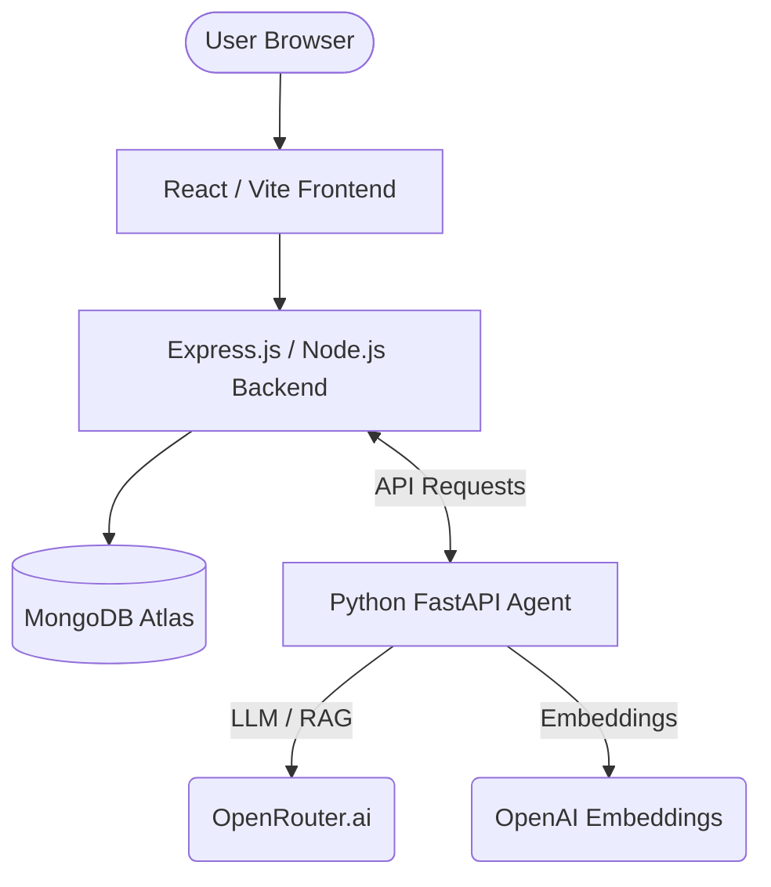

# 🤖 MOR: AI-Driven MERN Blog Platform

[](https://www.docker.com/)
[](https://www.mongodb.com/mern-stack)
[](https://openrouter.ai/)

**MOR** is a state-of-the-art blogging platform that bridges the gap between modern web development and Artificial Intelligence. It doesn't just host blogs; it generates them, indexes them, and allows users to "Ask AI" about any post using Retrieval-Augmented Generation (RAG).

---

## 🌟 Key Features

-   **🧠 AI Agent Service**: Automated blog generation based on trending topics or user prompts.
-   **🔍 RAG-Powered Q&A**: Each blog is indexed via vector embeddings, allowing users to ask specific questions about the content.
-   **🖥️ Full Administrative Dashboard**: Manage posts, users, and trigger AI generation with a single click.
-   **🐳 Dockerized Architecture**: Seamlessly orchestrated containers for Frontend, Backend, and AI Agent.
-   **☁️ Cloud Ready**: Optimized for deployment on AWS EC2 or scalable platforms like Render/Vercel.

---

## 🏗️ Technical Architecture

The project is split into three core microservices, communicating over a protected internal network:



---

## 🛠️ Technology Stack

### **Frontend**
- **React (Vite)**: High-performance UI.
- **Axios**: API communication.
- **Nginx**: Production-grade serving in Docker.

### **Backend**
- **Node.js & Express**: Scalable API architecture.
- **Mongoose**: Elegant MongoDB modeling.
- **JWT**: Secure user authentication.

### **AI Agent Service**
- **FastAPI**: Lightweight Python API.
- **LangChain**: Orchestration of LLM chains.
- **RAG Logic**: Custom Retrieval-Augmented Generation using cosine similarity.
- **OpenRouter/OpenAI**: Large Language Models (gpt-4o-mini).

---

## 🚀 Getting Started

### **Prerequisites**
- Docker & Docker Compose
- Node.js (for local dev)
- Python 3.11+ (for local dev)
- API Keys (OpenRouter, MongoDB Atlas)

### **Local Setup (Docker - Recommended)**
1.  Clone the repository:
    ```bash
    git clone https://github.com/LuckyChauhan18/MOR.git
    cd MOR
    ```
2.  Configure Environment Variables:
    - Create `.env` in `blog_web_app/backend/`
    - Create `.env` in `blog_agent_service/`
3.  Launch with one command:
    ```bash
    docker-compose up --build
    ```

---

## 🌍 Deployment

The project is designed for **AWS EC2** deployment.

**Commands for update:**
```bash
git pull origin main
sudo docker-compose down
sudo docker-compose up -d --build
```

---

## 👨‍💻 Contributing

1. Fork the Project
2. Create your Feature Branch (`git checkout -b feature/AmazingFeature`)
3. Commit your Changes (`git commit -m 'Add some AmazingFeature'`)
4. Push to the Branch (`git push origin feature/AmazingFeature`)
5. Open a Pull Request

---

## 📄 License

Distributed under the MIT License. See `LICENSE` for more information.

---
*Created by [Lucky Chauhan](https://github.com/LuckyChauhan18)*
